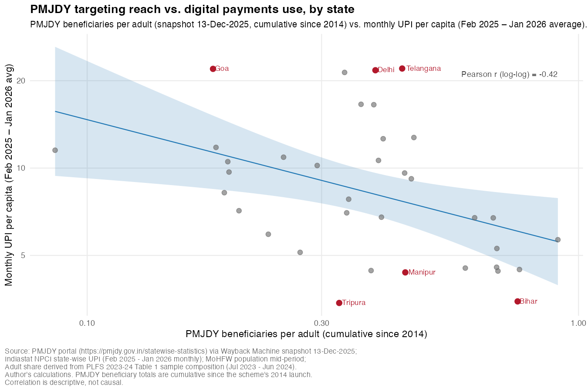
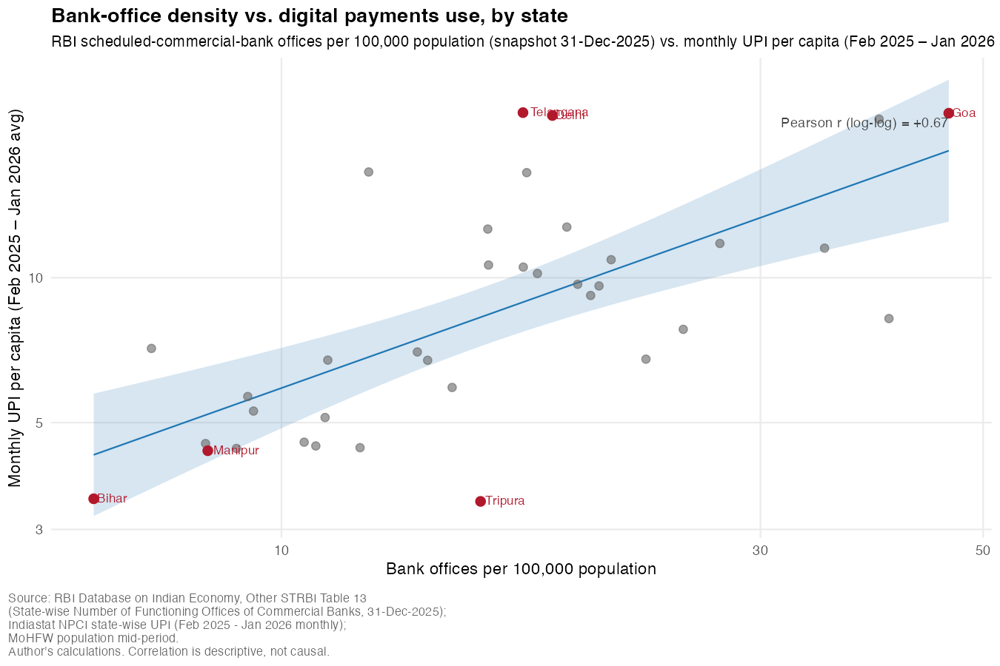

# 4. What predicts state-level digital-payment use

This section presents three findings about what predicts state-level digital-payment use across Indian states. Each finding is supported by two parallel regressions: the early-UPI era of FY 2019-20 and FY 2020-21, when UPI was one of five rails making up India's digital-payment stack, and the mature-UPI era of April 2023 through January 2026, when UPI alone settled the bulk of retail digital payments. Both regressions use the same four state-level controls (per-capita state domestic product, urban population share, PMJDY beneficiaries per adult, and bank-office density), the same estimator (pooled OLS with year fixed effects and standard errors clustered at the state level), and the same log–log specification. The mature-era regression adds a fifth control, internet density, that becomes available only in that period.

Full methodology, regression specifications, and detailed result tables are in Appendix A. Table 2 below summarises the headline coefficients on the four shared controls in both eras; the rest of this section walks through what the table makes visible.

## Table 2, Cross-era coefficients on the four shared controls

| Control | Early-UPI era (FY 2019-20 + 2020-21) | Mature-UPI era (Apr 2023 – Jan 2026) |
|---|---:|---:|
| log(per-capita NSDP) | **+1.17** ** | **+1.05** *** |
| log(urban share) | +0.25 | +0.06 |
| log(PMJDY beneficiaries / adult) | **+0.50** * | **+0.34** ** |
| log(bank offices / 100k pop) | −0.17 | −0.19 |
| Sample size (state-period observations) | 66 | 99 |

Bold figures are statistically distinguishable from zero. Significance: \* p<0.10, \*\* p<0.05, \*\*\* p<0.01. Coefficients are elasticities, a 1 percent change in the control is associated with a β-percent change in per-capita digital-payment use, holding the other controls constant.

## Finding 1: Income is the dominant correlate, in both eras

The cleanest empirical pattern in the two regressions is the income elasticity. In the early-UPI era it is +1.17, statistically significant at the 5 percent level; in the mature-UPI era it is +1.05, significant at the 1 percent level. Both are close to a unit elasticity. A 10 percent increase in a state's per-capita state domestic product is associated with about a 10 percent increase in its per-capita digital-payment use, and that relationship was already in place in 2019-21 and persisted essentially unchanged through 2024-25.

The two estimates are close enough that they are not statistically distinguishable from each other. This is meaningful in itself. The dependent variable in the early era was a five-rail composite (BHIM, IMPS, RuPay-on-POS, UPI, USSD); in the mature era it is pure UPI. The sample sizes differ; the panel structures differ; the controls differ in one variable. Yet the income-elasticity is the same. Whatever else changed about UPI between 2019 and 2026, the sheer scale of transactions, UPI's displacement of the four other rails, the doubling of bank-office counts, the addition of hundreds of millions of PMJDY beneficiaries, the income gradient of digital-payment use has held its shape.

Two readings follow. First, income is by far the most reliable predictor of where a state will sit in the cross-state distribution of digital-payment use, and any policy aimed at expanding digital payments at the state level is operating against a strong income gradient. Second, the durability of the relationship across two distinct measurement regimes makes it unlikely that the income gradient is an artefact of how the dependent variable is constructed in either era, it is a feature of the underlying state-level distribution. The pattern is associational, not causal; what it does establish is that any other state-level variable claimed to matter for digital-payment use needs to survive controlling for income. Findings 2 and 3 are both about which variables clear that bar.

## Finding 2: Financial-inclusion programs (PMJDY) add explanatory power beyond income, in both eras

This is the policy-relevant finding of the analysis. The coefficient on log(PMJDY beneficiaries per adult) is positive and statistically distinguishable from zero in both regressions: +0.50 in the early-UPI era (significant at the 10 percent level) and +0.34 in the mature-UPI era (significant at the 5 percent level). A 10 percent relative increase in PMJDY enrollment per adult is associated with a 3 to 5 percent increase in per-capita digital-payment use, holding income, urban share, bank-office density, and (in the mature era) internet density constant. The two estimates are statistically indistinguishable from each other.

The finding has more bite than the magnitudes alone suggest, because the univariate correlation between PMJDY enrollment and per-capita digital-payment use is negative across Indian states (Pearson r in log–log of about −0.42; see Figure 5). PMJDY-heavy states are poorer states, and poorer states use digital payments less. So unconditionally, more PMJDY enrollment looks associated with less digital-payment use. The negative univariate correlation is income masquerading as PMJDY.

Once we control for income, the sign flips. Among states at similar income levels, those with higher PMJDY enrollment per adult use more digital payments. The flip is not a regression artefact, it is what the data say once the income gradient is held constant. And the flip occurs in both eras: when PMJDY had been running for five to six years and was still in its build-out phase (early-UPI era), and when it had reached close to a decade of cumulative enrollment (mature-UPI era).

The mechanism is account access. PMJDY's design opens a basic savings account for unbanked households, and an account is the necessary condition for using a digital-payment rail at all. The variable measures the cumulative reach of that scheme, normalised by adult population. The regression detects that this measure of account access predicts digital-payment use beyond what income alone does, in both eras. The reading is not that PMJDY caused UPI adoption, the data here cannot establish that, but that programmatic financial inclusion has a durable association with digital-payments use that survives the income control.

The policy implication, developed in Section 5, is straightforward: financial-inclusion programs that decouple account access from income, as PMJDY does, by deliberately targeting the unbanked, leave a statistical footprint in cross-state digital-payment use. The same is not true of every variable that captures financial inclusion, as Finding 3 shows.

## Finding 3: Financial-inclusion infrastructure (bank offices) does not add beyond income, in either era

The contrast with PMJDY is sharp. The coefficient on log(bank offices per 100,000 population) is small and statistically indistinguishable from zero in both regressions: −0.17 in the early era, −0.19 in the mature era. Bank-office density does not survive joint inclusion with income. The same is true of urban share (+0.25 and +0.06, neither significant) and, in the mature era where it is available, internet density (+0.34, also not significant).

This is not because bank-office density is irrelevant to digital-payment use. The univariate correlation between bank-office density and per-capita UPI use is positive and substantial (Pearson r in log–log of about +0.67; Figure 6). States with more banking infrastructure per person do use more digital payments per person, in the unconditional cross-section.

The reason the conditional coefficient is null is collinearity with state income. In the cross-section of Indian states, bank-office density correlates with per-capita NSDP at roughly +0.85; urban share correlates with NSDP at roughly +0.7; internet density correlates with NSDP at +0.86. All three variables capture economically real and theoretically distinct channels, physical banking infrastructure, urban agglomeration, and telecom buildout, but they all move tightly with state income. Once income is in the regression, the marginal contribution of any of these variables beyond what NSDP already absorbs is statistically indistinguishable from zero.

PMJDY survives this test for one structural reason. PMJDY enrollment per adult correlates with per-capita NSDP at roughly −0.62, strongly negatively. The scheme deliberately targets the unbanked, who are concentrated in poorer states, so its beneficiary density runs in the opposite direction from income. That negative correlation is precisely what gives PMJDY identification beyond income: conditioning on income does not collapse PMJDY's variation, because income and PMJDY move in opposite directions across states.

The substantive distinction this draws is between two kinds of financial inclusion. Financial-inclusion infrastructure, bank offices, telecom buildout, urban agglomeration, is allocated by markets and grows with state income. In our data, it shows up through the income gradient, not beyond it. Financial-inclusion programs designed to reach the population outside that gradient, PMJDY in our case, show up beyond income in a way the regression can identify separately. This is the policy-relevant distinction the next section takes up.

A note on what we set aside: a sixth state-level variable, literacy, was tried in both eras and produced an interpretable pattern that we read as a measurement-validity problem with the literacy variable as conventionally defined rather than a substantive finding about literacy and digital payments. The full diagnostic is in Appendix A.
